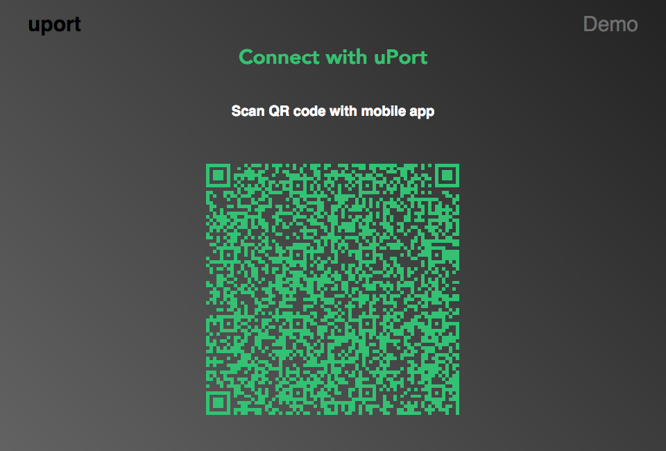
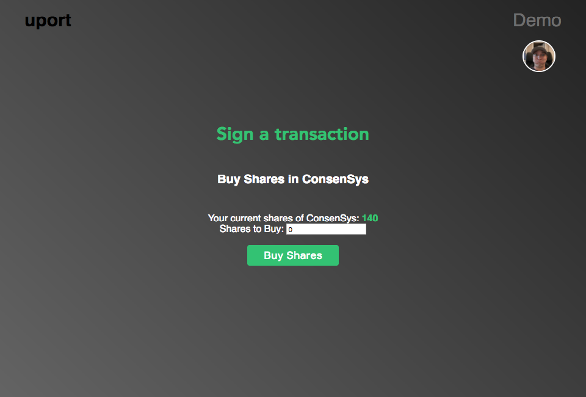
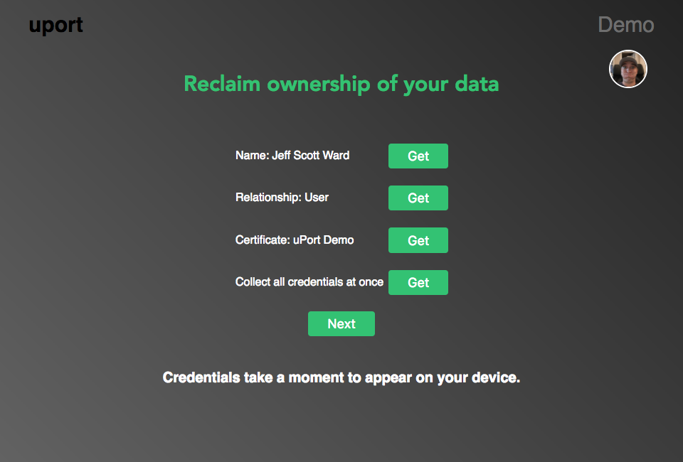

# uPort Demo

### About
This uPort demo is designed to showcase some of the basic features and approaches you will take to integrate uPort features into your project. Using [uport-connect](https://github.com/uport-project/uport-connect) itself is quite simple but requires a little bit of understanding the flow for a typical implementation.

**You are  encouraged to run through the demo at [demo.uport.me](https://demo.uport.me) before picking apart the code.**

----------

#### Getting Setup
Before making use of these features for yourself, we need to instantiate the uPort object with an identity.

[Click here to see the setup code](https://github.com/uport-project/demo/blob/master/src/utilities/uportSetup.js)

The `clientID` is the public address of your app and the `signer` (wrapped with the `SimpleSigner` function) is the signing key of your app that you will help create [JWT](http://jwt.io/) tokens. These bits of information are given to you after creating an application with the [uPort App Manager](appmanager.uport.me).

## Features

#### Requesting Credentials


[Click here to see the login (request credentials) code with a custom QR image](https://github.com/uport-project/demo/blob/master/src/components/ConnectYourUport.js#L16)

**By default** the [uport-connect](https://github.com/uport-project/uport-connect) library will fire a QR image inside of an injected global modal to help you get up an running quickly.

**This can be disabled** by intercepting the URI so you may use another library to customize the look and feel of the QR image.

Once the user has scanned the displayed QR image, and has submitted their credentials, the promise should resolve with a [Schema.org](http://schema.org/Person) `person` JSON data payload. You can then handle this data however you desire in the `then` function.

[uport.requestCredentials documentation can be found here](https://github.com/uport-project/uport-connect/blob/develop/DOCS.md#connectrequestcredentialsrequest-urihandler--promiseobject-error)

#### Signing Transactions


In a typical application, upon load, there is data usually being requested by a server to get the current state of the user's data. We must do the same here, but rather than reading a SQL database, we are instead reading the blockchain. At ConsenSys we use our Web 3.0 infrastructure stack called [Infura](infura.io) to make the amount of possible calls scalable.
You could otherwise have an Ethereum node local on your machine with a downloaded copy of the blockchain you could query. Calls can be simulated without having a copy of the blockchain though using a local [TestRPC](https://github.com/ethereumjs/testrpc) node, but thats out of scope for this explainer.

uPort comes pre-baked with a web3 instance that calls to [Infura](infura.io) to make your life easy. All you need to do is grab our web3 object and instantiate a smart contract javascript object with a **provided ABI**.

An ABI (Application BINARY Interface) can be generated by compiling your smart contract with the [Remix](https://ethereum.github.io/browser-solidity/) Web IDE. Its on the "Contracts" tab down where it says `interface`. You can deploy this contract to the chain with the `Web3 deploy` code just below that in your local Ethereum node console or with our build & deploy tool called [Truffle](http://truffleframework.com/).

With the uPort library, when a transaction is going to be signed, if the `notifications` flag is set to `true` when requesting credentials initially, **it will allow any future transaction signing to fire a prompt in the uPort mobile app.**

When a transaction is signed and submitted to a smart contract, the Ethereum network takes time to mine (confirm) the transaction (typically 15 seconds). During this time we will need to poll the Web3 node (aka provider and in our case, its Infura), to see if its been mined. We will keep checking it with a function called `waitForMined` and have a pending callback and a success callback to manage state.

[Click here to see the contract instantiation code](https://github.com/uport-project/demo/blob/master/src/utilities/SharesContract.js)

[Click here to see the getShares code](https://github.com/uport-project/demo/blob/master/src/utilities/getShares.js#L5)

[Click here to see the updateShares (transaction signing) code](https://github.com/uport-project/demo/blob/master/src/components/SignTransaction.js#L58)

[Click here to see the waitForMined code](https://github.com/uport-project/demo/blob/master/src/utilities/waitForMined.js#L18)

#### Attesting Credentials


One of the core needs of Web 3.0 is to build trust in a self-soverign world. We establish facts which are not mathmatically derived by social consensus. To create social consensus, actors must attest to things being true. We can do this with uPort using the `attestCredentials` function.

[Click here to see the attestation code](https://github.com/uport-project/demo/blob/master/src/components/CollectCredentials.js#L70)

#### Congratulations

You have now have good grasp about how to use uPort and how to manage the user experience of Web 3.0 applications. Welcome!

-------------------------

#### Contributing

###### Getting started
```
$ git clone git@github.com:uport-project/demo.git
$ yarn install
```

###### Development
```
npm run start
```

###### Deployment
*You will need Amazon S3 permissions to deploy - Contact [andres](https://www.google.com)*

To deploy to **demo.uport.me**
```
npm run deploy
```
To deploy to **demo.uport.space**
```
npm run deploy-test
```
